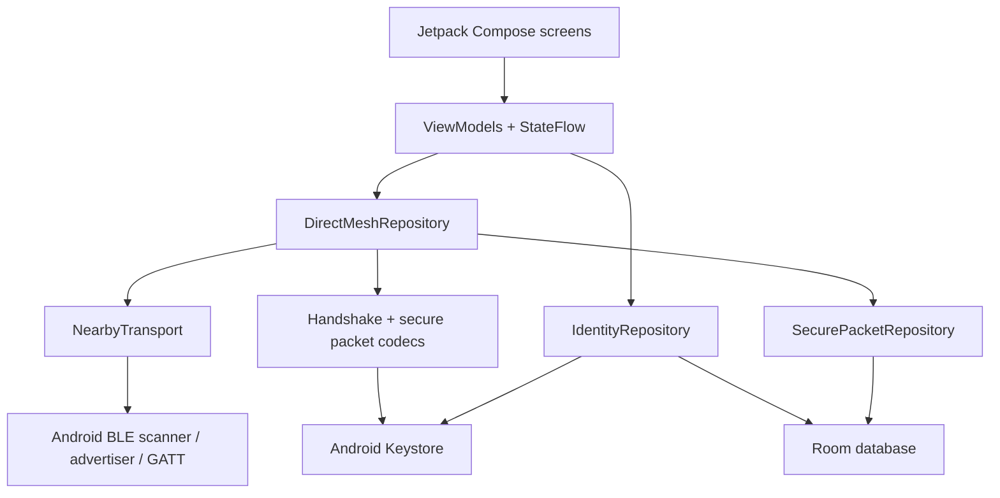

# CryptoMesh Beta Technical Documentation

## 1. Product Definition

CryptoMesh `0.2.0-beta01` is an Android reference implementation for offline,
authenticated text messaging over Bluetooth Low Energy with opportunistic
store-carry-forward mesh relay.

The current production path is:

```text
Local identity
  -> BLE discovery
  -> GATT connection
  -> signed ephemeral ECDH handshake
  -> AES-256 session
  -> signed encrypted message packet
  -> receiver verification and persistence
  -> encrypted end-to-end acknowledgement
  -> optional media offer/chunk/complete packets
```

The beta intentionally excludes every simulated feature previously used for
frontend demonstrations.

## 1.1 Recent reliability and media-transfer improvements

The latest update addressed the recurring offline/authentication bug and the
media-transfer instability that was causing chat disruption:

- stale authenticated sessions are cleaned up when a transport link drops,
  preventing peers from staying falsely authenticated after offline transitions
- media sends are detached from the synchronous chat action path and continue in
  the background so text messages remain responsive
- large payloads are split into BLE-friendly fragments, reassembled on receipt,
  and only marked complete after successful chunk verification and acknowledgements
- incomplete or interrupted transfers are marked as Failed rather than silently
  deleted so the UI can display a failure state and preserve metadata for retry
- image and video transfers are rendered as in-chat previews and can be opened
  after successful delivery; PDFs can be selected and opened through system apps
- large images are optimized before transfer to reduce packet volume and improve
  delivery speed while preserving app-level integrity checks

These changes keep the mesh session stable while allowing media to share the
same conversation timeline without breaking subsequent messages.

## 2. Technology Stack

| Area | Technology |
| --- | --- |
| Language | Kotlin 2.0.21 |
| Android plugin | Android Gradle Plugin 8.7.3 |
| Minimum Android | API 26 / Android 8.0 |
| Target Android | API 35 |
| UI | Jetpack Compose with Material 3 |
| UI state | ViewModel and StateFlow |
| Navigation | Navigation Compose 2.8.5 |
| Persistence | Room 2.7.2 with KSP |
| Serialization | kotlinx.serialization JSON 1.7.3 |
| Packet crypto | Android JCA |
| Identity key storage | Android Keystore |
| Concurrency | Kotlin coroutines |
| Unit tests | JUnit 4 and kotlinx-coroutines-test |

The Compose UI uses the `2024.12.01` BOM.

## 3. Source Layout

```text
app/src/main/java/com/cryptomesh/frontend/
  CryptoMeshApplication.kt       Application container
  MainActivity.kt                Compose host and window behavior
  crypto/                        Identity signatures and session ciphers
  data/local/                    Room entities, DAOs, and database
  data/repository/               Identity, packet, and direct-mesh repositories
  navigation/                    Routes and three-tab beta navigation
  protocol/                      Handshake, wire, and secure-packet codecs
  transport/                     BLE permissions, framing, and Android GATT
  ui/components/                 Reusable Compose components
  ui/screens/                    Beta screens
  ui/state/                      ViewModels and immutable UI models
  ui/theme/                      Material theme
```

## 4. Architecture



Compose screens do not call Android Bluetooth, Room, or cryptography APIs
directly. Android-specific work is behind repository and transport interfaces.

A recent design adjustment keeps media transfers in the same message timeline as
conversation events instead of rendering them as a detached top-of-thread card.
The `ChatViewModel` orders conversation messages and media transfer records by
creation timestamp, and the `ChatScreen` timeline displays them as a single
scrolling sequence. This preserves the natural chat flow even when a media file
is being transferred or has just completed.

## 5. Application Startup

`CryptoMeshApplication` creates a process-level `AppContainer`.

The container owns:

- `CryptoMeshDatabase`
- `AndroidIdentityKeyStore`
- `RoomIdentityRepository`
- `RoomSecurePacketRepository`
- `AndroidBleTransport`
- `BleDirectMeshRepository`
- An application coroutine scope using `SupervisorJob + Dispatchers.Default`

`CryptoMeshApp` observes the identity repository before choosing onboarding or
the main application.

Main beta destinations:

- Home
- Peers
- Chat

Secondary routes:

- Welcome
- Create Identity
- Profile
- Permissions

## 6. Local Identity

### 6.1 Key generation

`AndroidIdentityKeyStore` creates an EC key pair using:

- Provider: `AndroidKeyStore`
- Alias: `cryptomesh_identity_signing_v1`
- Curve: `secp256r1` / P-256
- Signature: `SHA256withECDSA`
- Purpose: sign and verify
- User authentication: not required

The private key is non-exportable and remains in Android Keystore.

### 6.2 Identity metadata

Room stores:

- Display name
- Device ID
- Base64 public signing key
- Public-key fingerprint preview
- Creation timestamp

The device ID is:

```text
CM- + uppercase hexadecimal(first 4 bytes of SHA-256(public signing key))
```

Example:

```text
CM-9F242D5E
```

The device ID is a compact key-derived identifier, not a globally registered
account.

### 6.3 Key reconciliation

When identity metadata exists but the Keystore key is unavailable, the identity
repository creates new key material and updates the key-derived device ID. This
prevents metadata restored without its non-exportable private key from claiming
the old identity.

### 6.4 Reset

Confirmed reset:

1. Clears all secure-packet rows.
2. Clears identity metadata.
3. Deletes the Keystore alias.
4. Causes the direct-mesh repository to close transport and clear sessions.
5. Returns the UI to onboarding.

## 7. Android Permissions

Android 12 and newer:

- `BLUETOOTH_SCAN`
- `BLUETOOTH_ADVERTISE`
- `BLUETOOTH_CONNECT`

Android 13 and newer:

- `POST_NOTIFICATIONS`

Android 8 through Android 11:

- Legacy `BLUETOOTH`
- Legacy `BLUETOOTH_ADMIN`
- `ACCESS_FINE_LOCATION` for BLE scanning

Legacy Bluetooth and location declarations use `maxSdkVersion` limits. Scan
permission is marked `neverForLocation` on newer Android versions.

The manifest declares BLE as optional so unsupported devices can install the app
and receive an explicit unavailable state.

## 8. BLE Discovery

### 8.1 Advertisement

CryptoMesh advertises a connectable BLE service.

Service UUID:

```text
7dd65a20-18ed-4bb7-84df-34d447b008a1
```

Manufacturer ID used by this prototype:

```text
0x0C4D
```

The main advertisement carries the service UUID. The scan response carries the
compact CryptoMesh device ID as manufacturer data.

The advertised device ID is untrusted until the signed handshake proves that it
matches the peer public key.

### 8.2 Scanning

The scanner filters for the CryptoMesh service UUID and reports:

- Android BLE link ID/address
- Advertised device ID
- RSSI

RSSI is normalized into user-facing signal and proximity labels.

Scanning stops when the Peers composable leaves composition.

## 9. GATT Transport

CryptoMesh devices operate as both:

- GATT server/peripheral for incoming connections.
- GATT client/central for outgoing connections.

Characteristic UUID:

```text
be07bf18-5306-4d9a-9b44-26875e2cc605
```

The characteristic supports:

- Client writes to the server.
- Server notifications to the client.

The standard Client Characteristic Configuration descriptor enables
notifications.

The client requests:

- High connection priority.
- MTU up to 517 bytes.

Protocol framing still uses conservative 180-byte frames so it does not depend
on the maximum requested MTU being accepted.

## 10. BLE Frame Format

Every wire message is split into frames.

Frame header:

| Bytes | Field |
| --- | --- |
| 0-1 | Magic bytes `C`, `M` |
| 2 | Frame version |
| 3-6 | 32-bit message ID |
| 7 | Chunk index |
| 8 | Total chunk count |
| 9+ | Frame payload |

Constraints:

- Default maximum frame size: 180 bytes.
- Maximum chunks per wire message: 128.
- Maximum incomplete messages retained: 32.
- Reassembly keys include source link ID and message ID.
- Duplicate chunk indices do not replace an accepted chunk.
- Partial frames are cleared when a link closes.

Client writes and server notifications are queued and sent sequentially.

## 11. Authenticated Handshake

Each side creates a new ephemeral P-256 ECDH key pair and a 32-byte random nonce.

Handshake fields:

- Protocol version
- Device ID
- Display name
- Persistent signing public key
- Ephemeral ECDH public key
- Random nonce
- Creation timestamp
- ECDSA signature

The signature covers every field except the signature itself.

Peer validation requires:

1. Supported protocol version.
2. A different local and remote device ID.
3. Non-empty display name.
4. Timestamp within five minutes.
5. Device ID derived from the supplied signing public key.
6. Match between discovered and authenticated device IDs when discovery
   supplied one.
7. Valid ECDSA signature.
8. Valid 32-byte handshake nonce.

Failure prevents session creation.

## 12. Session-Key Derivation

After handshake validation:

1. P-256 ECDH produces a shared secret.
2. Local and remote nonces are ordered by device ID.
3. SHA-256 of the ordered nonces becomes HKDF salt.
4. Ordered device IDs and a protocol label become HKDF info.
5. HKDF-SHA256 derives a 32-byte session key.

Both devices independently derive the same key.

The session key is process-memory-only and is not persisted.

## 13. Session Encryption

`AesGcmSessionCipher` uses:

- AES-256
- GCM mode
- 12-byte random nonce per encryption
- 128-bit authentication tag

The cipher prefixes its nonce to the ciphertext. Packet header serialization is
provided to GCM as associated authenticated data.

Session keys and plaintext are never written to the Room packet table.

## 14. Direct Wire Protocol

The BLE message layer uses a versioned JSON envelope:

- Protocol version
- Kind
- Base64 payload

Supported kinds:

- Handshake
- Secure packet

The payload is serialized independently and then wrapped so the transport can
route handshake and encrypted-packet messages without parsing plaintext.

## 15. Secure Packet Envelope

Secure packet fields:

- Protocol version
- Packet UUID
- Packet type
- Sender device ID
- Receiver device ID
- Creation time
- Optional expiry time
- 16-byte replay nonce
- SHA-256 plaintext hash
- AES-GCM encrypted payload
- ECDSA signature

Beta packet types:

- Message
- Acknowledgement
- MediaOffer
- MediaAccept
- MediaReject
- MediaChunk
- MediaChunkAcknowledgement
- MediaComplete

The media packet types are the Phase 1 protocol foundation for offline
photo, video, and audio transfer. Full media storage, transfer scheduling,
chunk persistence, UI, and resume behavior are implemented in later phases.

### 15.1 Sealing

1. Build versioned packet header.
2. Serialize header as AES-GCM associated data.
3. Encrypt payload with the session cipher.
4. Hash plaintext with SHA-256.
5. Sign the header, hash, and ciphertext with the persistent Keystore key.

### 15.2 Opening

1. Verify protocol version.
2. Reject expired packets.
3. Verify signature using the authenticated peer signing key.
4. Decrypt with the session key and authenticated header.
5. Compare SHA-256 plaintext hash using constant-time equality.

Malformed, expired, tampered, or incorrectly signed packets are rejected.

## 16. Decentralized Offline Message And Media Flow

Sender:

1. Requires a previously authenticated peer session.
2. Validates and trims text.
3. Creates a secure Message packet with 24-hour expiry.
4. Stores the encrypted envelope with `Queued` status.
5. Adds an in-memory outgoing message.
6. Sends directly when the receiver is connected.
7. Otherwise forwards through connected authenticated mesh peers.
8. Updates Room to `AwaitingAcknowledgement` after any successful handoff.

Receiver:

1. Confirms the packet receiver is the local device.
2. Verifies and decrypts the secure packet.
3. Inserts the encrypted envelope with duplicate-safe Room semantics.
4. Adds plaintext to in-memory UI state only for a new packet.
5. Sends an encrypted Acknowledgement packet back through the same mesh layer.

Relay node:

1. Requires the carrier BLE link to be authenticated.
2. Stores non-local secure packets as `Relay` ownership.
3. Does not decrypt relay payloads.
4. Forwards first to a directly connected receiver when available.
5. Otherwise forwards once per packet/link to other authenticated mesh peers.
6. Drops expired packets and suppresses duplicates by packet ID.

Sender ACK handling:

1. Verifies and decrypts the ACK.
2. Reads the acknowledged packet UUID.
3. Updates the packet row to `Acknowledged`.
4. Updates the UI to double-check status.

Duplicate Message packets are not added twice, but can be acknowledged again.

Media:

1. Sender creates a `MediaOffer` with media kind, file metadata, full-file
   SHA-256, chunk size, chunk count, transfer key, and expiry.
2. Sender splits the selected photo, video, or audio bytes into bounded chunks.
3. Each chunk is encrypted with a per-transfer AES-256-GCM key and carries a
   chunk SHA-256.
4. The encrypted chunk payload is sealed inside a signed secure packet.
5. Receiver stores encrypted chunks in app-private storage, verifies chunk
   hashes after decrypting, and tracks progress in Room.
6. When every chunk is present, receiver reassembles bytes, verifies the
   full-file SHA-256, writes the completed media file, and sends `MediaComplete`.
7. Relays store and forward sealed media packets only; they do not decrypt
   transfer contents.

## 17. Persistence

Database:

```text
cryptomesh.db
```

Room schema version: `1`

Exported schema:

```text
app/schemas/com.cryptomesh.frontend.data.local.CryptoMeshDatabase/1.json
```

### 17.1 `local_identity`

Stores one local identity row. The private signing key is not present.

### 17.2 `secure_packets`

Stores encrypted packet envelopes and delivery metadata.

Indexes:

- Receiver ID
- Status
- Creation time

Packet insertion uses `OnConflictStrategy.IGNORE` with packet UUID as primary
key, providing local duplicate rejection.

### 17.3 Backup policy

Android backup is disabled. Keystore private keys are non-exportable, so
restoring encrypted database state without the original key would produce
inconsistent identity ownership.

## 18. UI State

### Home

Consumes `DirectMeshState` directly and shows real peer/session/message counts.

### Peers

`PeerDiscoveryViewModel` maps `DirectPeer` state to:

- Available
- Connecting
- Authenticating/Verifying
- Connected
- Failed

No sample peers or timed connection transitions exist.

### Chat

`ChatViewModel` creates conversations only for peers with an authenticated
device ID. It maps repository message states to:

- Queued
- Sending
- Awaiting acknowledgement
- Acknowledged
- Failed

No seeded conversation, attachment, file, wallet, sync, or contact-picker state
exists.

### Notifications

`MeshNotificationCoordinator` observes the application-scoped
`DirectMeshRepository.state` flow. The initial state is used as a baseline, and
later state changes are converted into local Android notifications by
`MeshNotificationEventDetector`.

Notification channels separate messages, peer connections, and mesh status.
Events include peer discovery, incoming authentication, connection completion or
failure, disconnects, incoming messages, acknowledgement/failure changes, and
transport errors. Tapping a notification routes the existing activity to Home,
Peers, or Chat.

## 19. Keyboard Behavior

`MainActivity` uses the manifest `adjustResize` window mode.

Compose owns IME movement:

- Only the message composer uses `imePadding`.
- The main bottom navigation is absent while a conversation is open.
- The message list scrolls to the newest item when messages or IME visibility
  change.
- Header remains in the thread layout.
- Composer remains above the IME.
- Message list animates to the last item when message count or IME height
  changes.

## 20. Security Properties

Provided:

- Non-exportable persistent signing key.
- Key-derived device IDs.
- Signed ephemeral key exchange.
- Per-session forward-secret ECDH key material.
- Authenticated AES-GCM encryption.
- Signed packet envelopes.
- Header integrity through associated data.
- Payload hash verification.
- Packet expiry.
- Duplicate-safe packet storage.
- Encrypted application-level ACKs.
- No Room plaintext-message column.

Not provided:

- Human identity certification.
- QR, safety-number, or out-of-band verification.
- Protection if Android Keystore or the device OS is compromised.
- Background delivery guarantees.
- Multi-device account recovery.
- Group key management.
- Metadata concealment for BLE discovery.
- Relay anonymity.
- Backend identity revocation.

The handshake proves continuity with the presented signing key and its
key-derived device ID. It does not prove the real-world identity of the person
holding the phone.

## 21. Testing

Test areas:

- Stable identity persistence and reset.
- Keystore metadata reconciliation through repository contracts.
- Duplicate-safe packet insertion.
- Packet status updates, expiry cleanup, and full clear.
- AES packet round-trip.
- Ciphertext, metadata, signer, and expiry rejection.
- Signed ECDH session-key agreement.
- Discovered identity mismatch rejection.
- Wire envelope round-trip.
- Out-of-order BLE frame reassembly.
- Cross-peer frame isolation.
- Invalid-frame rejection.
- End-to-end paired repository discovery, authentication, message, persistence,
  and ACK.
- Three-node authenticated mesh relay with end-to-end message delivery and
  relayed ACK.
- Media offer/chunk codec round trips, encrypted chunk tamper rejection,
  reassembly verification, and three-node offline media relay completion.
- Empty beta ViewModel startup state.
- Live peer/conversation mapping.
- Connection, disconnection, send, retry, and unavailable-session behavior.

Run:

```bash
./gradlew :app:testDebugUnitTest
```

Full gate:

```bash
./gradlew :app:testDebugUnitTest :app:lintDebug :app:assembleDebug
```

## 22. Beta Limitations

- Physical BLE transport still requires validation across target phone vendors.
- Advertising and GATT behavior can vary by chipset and Android customization.
- Transport runs in the application process without a foreground service.
- No automatic reconnect or handshake timeout policy.
- Readable chat history is not restored after process death.
- Stored packets cannot be reopened after the ephemeral session key is gone.
- One GATT path is implemented; no Wi-Fi Direct upgrade path exists.
- Text messages are limited to 1,000 UI characters.
- Large videos are constrained by BLE throughput and available app-private
  storage.
- No instrumentation suite currently drives two physical devices.

## 23. Release Checklist

Before distributing a beta build:

1. Run the full Gradle gate.
2. Install the APK on two physical target devices.
3. Test both devices as connection initiator.
4. Test Android 12+ permission behavior.
5. Test one Android 8-11 device if supported.
6. Verify identity survives process restart.
7. Verify discovery, authentication, bidirectional messaging, and ACK.
8. Test Bluetooth toggling and permission denial.
9. Test disconnect and reconnect.
10. Test long and rapid message sequences with keyboard open.
11. Confirm no sample data appears after clean install.
12. Confirm identity reset clears database rows and returns to onboarding.
13. Record device model, Android version, and observed BLE errors.

## 24. Planned Engineering Work

Recommended next milestones:

1. Foreground connection service and lifecycle management.
2. Handshake, connect, and ACK timeouts.
3. Automatic reconnect with bounded backoff.
4. Persisted encrypted conversation history with a durable local content key.
5. Android instrumentation tests.
6. Two-device hardware test harness.
7. QR/safety-number peer verification.
8. Release signing and CI artifact generation.
